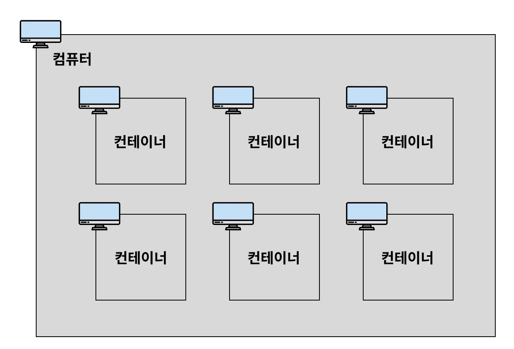

### docker란?

- 컨테이너를 사용하여 분리된 환경에서 프로그램을 관리 및 실행 할 수있는 툴이다

### container란?

예를 들어 위도우 환경에서는 하나의 컴퓨터 내에서 여러 사용자가 컴퓨터를 사용할 수 있다

컨테이너도 위와 비슷하다. 하나의 컴퓨터 내에서 독립적인 여러개의 미니컴퓨터를 실행 시킬 수있다

이 미니 컴퓨터를 보고 도커에서는 컨테이너라고 부른다

여기서 ‘**컨테이너**’와 ‘**컨테이너를 포함하고 있는 컴퓨터**’를 구분하기 위해 컨테이너를 포함하고 있는 컴퓨터를 ‘**호스트(host) 컴퓨터**’라고 부른다. 

### 컨테이너의 독립성

- **디스크 (저장 공간)** : 각 컨테이너마다 서로 각자의 저장 공간을 가지고 있다. 일반적으로 A 컨테이너 내부에서 B 컨테이너 내부에 있는 파일에 접근할 수 없다.
- **네트워크 (IP, Port)** : 각 컨테이너마다 고유의 네트워크를 가지고 있다. 컨테이너는 각자의 IP 주소를 가지고 있다.

### 이미지란?

닌텐도의 칩과 비슷한 개념

예를 들어 Node.js 기반의 Express.js 서버 프로젝트를 이미지로 만들었다고 가정해보자. 이 이미지를 Docker로 실행시키면 Express.js 서버 프로젝트가 컨테이너(Container) 환경에서 실행된다. 복잡한 설치 과정을 거칠 필요 없이 손쉽게 실행된다. 

또 다른 예로, MySQL 서버를 이미지로 만들었다면, 이 이미지를 Docker로 실행시키는 순간 MySQL 서버가 컨테이너(Container) 환경에서 실행된다. MySQL을 일일이 설치할 필요없이 MySQL 데이터베이스를 사용할 수 있게 된다. 

**이미지(Image)** 는 **프로그램을 실행하는 데 필요한 설치 과정, 설정, 버전 정보 등을 포함**하고 있다. 즉, **프로그램을 실행하는 데 필요한 모든 것을 포함**하고 있다.